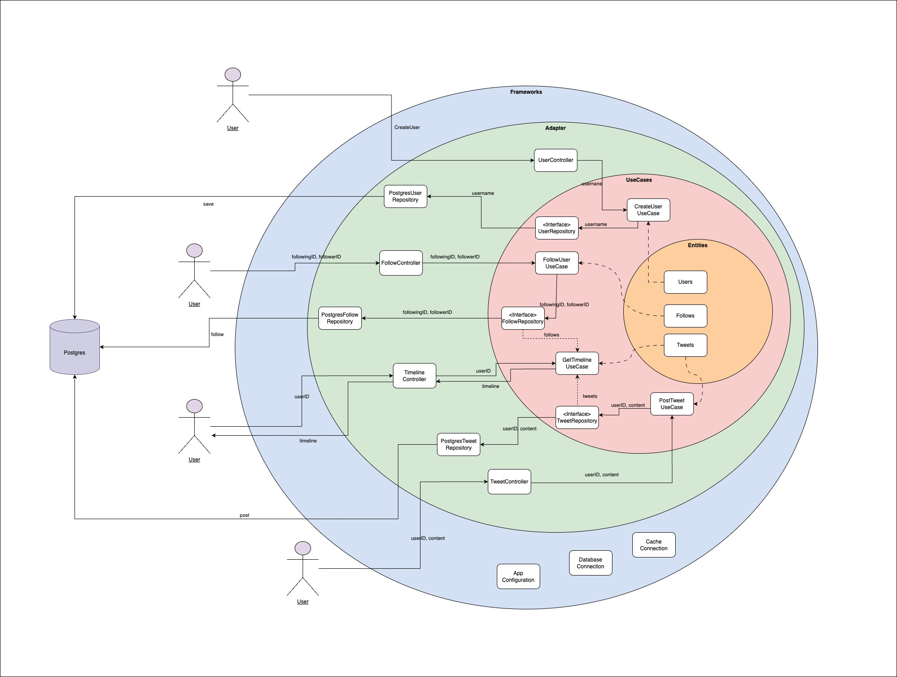
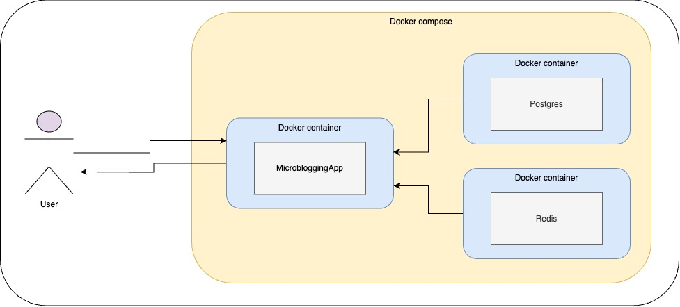
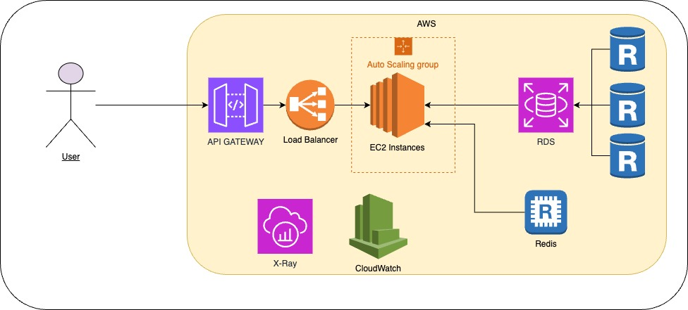
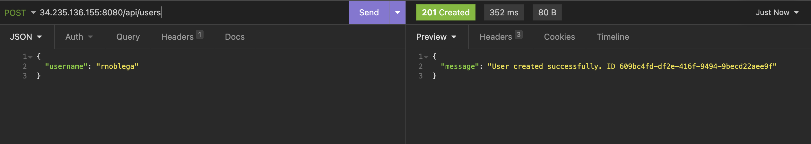
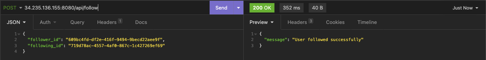
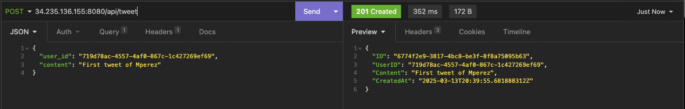
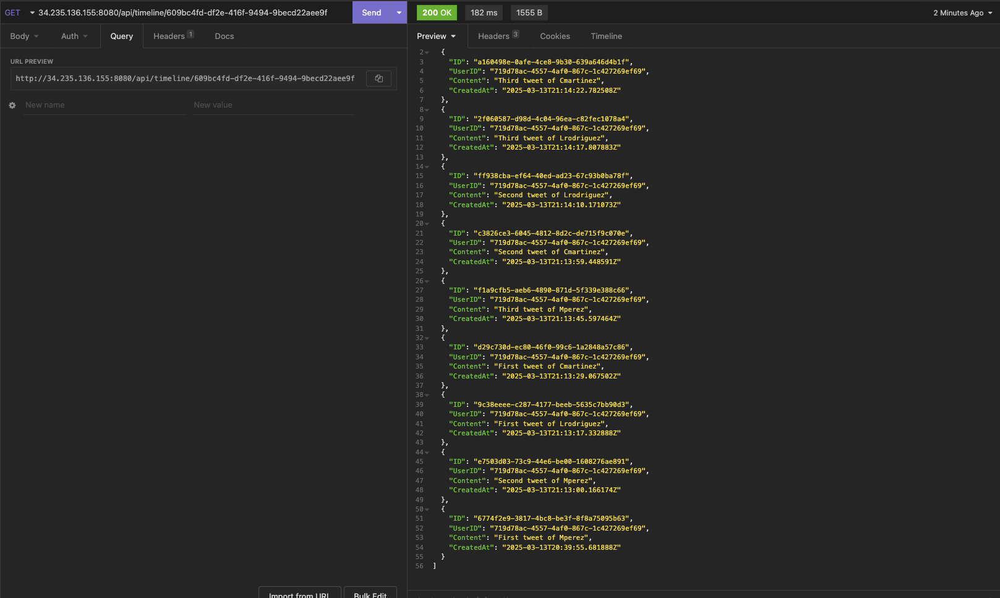
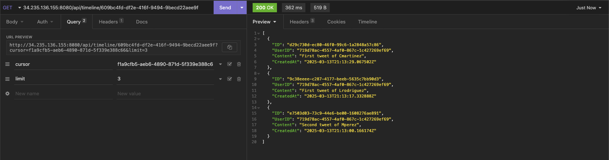
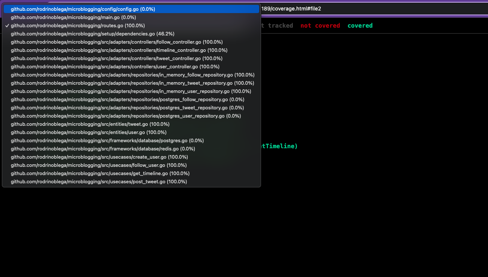

# Microblogging - UALA


A microblogging platform that tries to simulate Twitter's behavior.

Features
- Post Tweets: Users can create short tweets posts.
- Follow People: Users can follow other users.
- Feed Display: A chronological feed displaying posts from all users they follow.
- User Creation: User creation with username.


## Project Structure - Clean Architecture

The architecture is based on the concept of Clean Architecture. Clean Architecture is a software design principle to create a clear separation between different components of an application. This structure enhances maintainability, testability, and scalability by defining clear boundaries between layers.

**Organizing the code into distinct layers ensures that the business logic remains independent of external frameworks or infrastructure, making it easier to adapt to future changes, such as switching from one external tool (e.g., PostgreSQL) to another (e.g., MongoDB), without impacting the core application logic.**
The architecture consists of four main layers:

- Entities: Core business logic and data structures.
- Use Cases: Defines the application’s specific business rules and the interactions between entities.
- Adapters: Interfaces to external systems and tools.
- Frameworks: Handles external dependencies and integrations.

### Project Structure - Diagram



## Architecture

### Local



This project uses Docker Compose to manage the necessary services (PostgreSQL, Redis, migrations, and the application). To run the project locally, follow the steps below.

You can run the app locally using Docker by executing the following command:

```docker compose up --build ```

This command will:
- Start a local PostgreSQL instance on port 5432.
- Start a local Redis cache instance on its default port.
- Make all the migration process using the files in /migrations.
- Start the Microblogging application locally.

### Prod



The system is designed to scale efficiently and handle a high number of users while ensuring optimal read performance.
The API Gateway manages incoming requests, routing them to the application. A Load Balancer distributes traffic across multiple EC2 instances, which are part of an Auto Scaling Group to dynamically adjust capacity based on demand.
To optimize read performance, the application uses Redis as a caching layer, reducing direct database queries. The RDS handles persistent data storage and supports read replicas to distribute the read load. Additionally, X-Ray and CloudWatch are integrated for monitoring and tracing requests.
To prevent excessive database load when retrieving tweets, the application implements pagination, ensuring efficient data retrieval and preventing system overload.

Why Each Component Was Chosen
- API Gateway: Centralized request management, authentication, and throttling.
- Load Balancer: Distributes traffic evenly across multiple instances, improving reliability.
- EC2 Auto Scaling Group: Ensures the system can scale up or down based on traffic.
- Redis: Reduces database load by caching frequent queries, improving read performance.
- RDS with Read Replicas: Enables horizontal scaling for read-heavy workloads.
- X-Ray & CloudWatch: Provides visibility into system performance and request tracing.

Amazon RDS was chosen as the PostgreSQL host because it simplifies database management while ensuring scalability, security, and high availability.
- Scalability: It allows read replicas, helping to handle many users efficiently.
- Fast Queries: Supports indexing, which significantly improves search performance.
- Data Integrity: Ensures consistency and prevents data corruption.
- Flexibility: Supports structured (SQL) and semi-structured (JSON) data.
  
Additional Notes
The PostgreSQL password is currently stored in the configuration files, but the recommended approach is to use AWS Secrets Manager or similar services to securely manage sensitive credentials.

## Example

This section demonstrates a typical application flow. You can either run the application locally or make API calls to the services deployed on AWS (34.235.136.155).

### User creation

The following users were created:
- rnoblega
- mperez
- lrodriguez
- cmartinez

The image below serves as evidence, but additional API calls were made.



### Follow users

rnoblega follows:
- mperez
- lrodriguez
- cmartinez

The image below serves as evidence, but additional API calls were made.




### Posting tweets

The following tweets were posted in chronological order:

- "First tweet of mperez" --> mperez
- "Second tweet of mperez" --> mperez
- "First tweet of lrodriguez" --> lrodriguez
- "First tweet of cmartinez" --> cmartinez
- "Third tweet of mperez" --> mperez
- "Second tweet of cmartinez" --> cmartinez
- "Second tweet of lrodriguez" --> lrodriguez
- "Third tweet of lrodriguez" --> lrodriguez
- "Third tweet of cmartinez" --> cmartinez

The image below serves as evidence, but additional API calls were made.





### Timeline of rnoblega

The timeline should display tweets from mperez, lrodriguez, and cmartinez, sorted from newest to oldest without a cursor or limit:

- "Third tweet of cmartinez"
- "Third tweet of lrodriguez"
- "Second tweet of lrodriguez"
- "Second tweet of cmartinez"
- "Third tweet of mperez"
- "First tweet of cmartinez"
- "First tweet of lrodriguez"
- "Second tweet of mperez"
- "First tweet of mperez"




The timeline should display tweets from mperez, lrodriguez, and cmartinez, sorted from newest to oldest, starting from the fifth tweet and with a limit of 3.:

- "First tweet of cmartinez"
- "First tweet of lrodriguez"
- "Second tweet of mperez"



## Testing strategy

The project follows Clean Architecture principles and aims for high test coverage. The development process was guided by Test-Driven Development (TDD) to ensure reliability and maintainability.

- 100% coverage in core business layers (Use Cases & Entities) to guarantee that all business logic is fully tested.
- Unit tests to validate business rules independently.
- Integration tests to verify interactions between components.
- Mocks and in-memory databases to simulate dependencies efficiently.

```
go test ./... -coverpkg=./... -coverprofile=coverage.out
```

```
go tool cover -html=coverage.out
```

These commands will generate a coverage report highlighting a high percentage of their lines covered by tests.



## External Libraries Used

External libraries:
- Testify: Used for writing tests, providing assertions and test suite functionality.
- UUID: Ensures unique identifiers for entities.
- Gin: A high-performance HTTP web framework that simplifies request handling and routing.
- Viper: Manages application configuration, supporting environment variables.
- GORM: An ORM for Go that simplifies database interactions.
- Postgres Driver: Enables GORM to interact with PostgreSQL.
- Redis: Client to connect to Redis.

## Questions

* [rnoblega@gmail.com](rnoblega@gmail.com)

