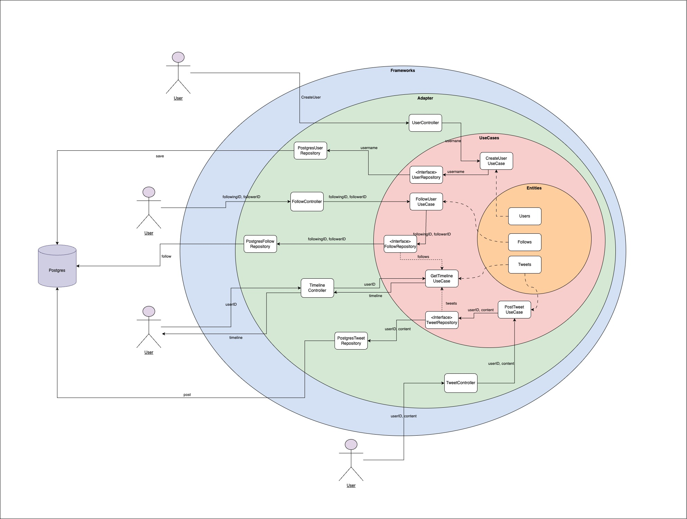

# Microbligging - UALA


Microblogging platform that try to simulate the behaviour of Twitter.

Features
- Post Tweets: Users can create short tweets posts.
- Follow People: Users can follow other users.
- Feed Display: A chronological feed displaying posts from all users they follow.
- User Creation: User creation with an username.


## Project Structure - Clean Architecture

The architecture is based on the concept of Clean Architecture. Clean Architecture is a software design principle to create a clear separation between different components of an application. This structure enhances maintainability, testability, and scalability by defining clear boundaries between layers.

**Organizing the code into distinct layers ensures that the business logic remains independent of external frameworks or infrastructure, making it easier to adapt to future changes, such as switching from one external tool (e.g., PostgreSQL) to another (e.g., MongoDB), without impacting the core application logic.**
The architecture consists of four main layers:

- Entities: Core business logic and data structures.
- Use Cases: Defines the application’s specific business rules and the interactions between entities.
- Adapters: Interfaces to external systems and tools.
- Frameworks: Handles external dependencies and integrations.

### Project Structure - Diagram



## How to run the application

### Prerequisites

Ensure you have the following installed before running the application:
- Go (version 1.23 or later)
- A terminal with access to run CLI commands
- Git (for cloning the repository)
- Docker (if running with a container)

This project uses Docker Compose to manage the necessary services (PostgreSQL, Redis, migrations, and the application). To run the project locally, follow the steps below.

You can run the app locally with Docker executing.

```docker compose up --build ```

This command will:
- Start a PostgreSQL locally in the port 5432.
- Start a Redis Cache locally in the port 
- Make all the migration process using the files in /migrations.
- Start the Microblogging application locally.


In your code, by providing a cursor (which is the ID of the tweet from which you want to start pagination), the query filters tweets created before the creation date of the tweet corresponding to the cursor. This allows efficient retrieval of tweets preceding the cursor, ordered in descending order by creation date, and limited to the number specified by the limit.


Además de las optimizaciones actuales, es recomendable incluir en la documentación del proyecto posibles mejoras futuras, como:

Particionamiento de Tablas: Dividir tablas grandes en particiones más pequeñas para mejorar el rendimiento de las consultas.

Índices Adicionales: Crear índices en columnas que se utilizan frecuentemente en filtros y órdenes para acelerar las consultas.